In this project, we analyzed data from RNA-seq and ATAC-seq of innate lymphoid cells to characterize their regulatory landscape. We analyzed correlation and genomic distance, and modeled regression to answer key questions about how CRES influence gene expression, how they organize spatially in connection to TSSs and how specific these elements are for every cell type. Our goal was to identify regulatory profiles that define cell identity and allow to understand the mechanisms that control differentiation and function of this immune cells.

---

<details>
<summary><strong>Table of Contents</strong></summary>

- [Introduction](#introduction)
  - [The gene regulatory network](#the-gene-regulatory-network)
  - [Innate lymphoid cells (ILC) and Natural Killer cells (NK)](#innate-lymphoid-cells-ilc-and-natural-killer-cells-nk)
  - [Data sets](#data-sets)
- [Results](#results)
  - [Quality Control](#quality-control)
  - [Transcription Start Site analysis](#transcription-start-site-analysis)
  - [Clustering by ATAC signal](#clustering-by-atac-signal)
    - [Do related cell types cluster together based on their ATAC signal?](#do-related-cell-types-cluster-together-based-on-their-atac-signal)
    - [Can one define different classes of peaks?](#can-one-define-different-classes-of-peaks)
  - [Clustering by expression profile](#clustering-by-expression-profile)
  - [Correlation Analysis between CREs and Gene Expression](#correlation-analysis-between-cres-and-gene-expression)
  - [Regression analysis](#regression-analysis)
- [Discussion](#discussion)
- [References](#references)
- [Repository Usage and Structure](#repository-usage-and-structure)
  - [Conda Environment](#conda-environment)
    - [Conda Setup](#conda-setup)
    - [Installing new packages](#installing-new-packages)
  - [File structure](#file-structure)

</details>

---

# Introduction

The differentiation of gene expression allows multicellular organisms to generate a broad variety of cell types and tissue from the same genome. This regulation is mediated by complex nets of transcriptional factors and regulatory elements that work in a coordinated way. Cis-regulatory elements (CREs) are part of this elements, specific regions of the genome that can influence the transcription of nearby genes or even faraway located genes. The promoters, located around the transcription start site (TSS) and enhancers, that can be located hundred kb of distance, are examples of CREs that modulate gene activity. 

The sequencing technology of RNA-seq allows to quantify gene expression in great scale, meanwhile the sequencing of accessible chromatin (ATAC-seq) allows a direct vision of the regions of the genome that are open and potentially active in regulatory pathways. The integration of both technologies allows to establish causal relationships between chromatin accessibility and gene expression, revealing regulatory mechanisms for specific cell lineages. 

## The gene regulatory network

Understanding how gene expression is controlled by the genome is crucial in biology. This involves decoding the cis-regulatory code, which describes how DNA sequences determine when, where, and how much each gene is transcribed in a given state of differentiation. Unlike the genetic code, which is universal and modular, the cis-regulatory code is often influenced by interactions across large genomic regions [(4)](#4).

Central in this system are cis-regulatory elements (CREs), which are non-coding regions of the genome that control the transcription of nearby genes. These elements include promoters, which are located close to transcription start sites and serve as initiation points for transcription, and enhancers, which can be located far from their target genes and modulate transcription in a context-dependent manner. Enhancers often act in combinations and are activated or repressed by specific transcription factors, shaping gene expression patterns. [(2)](#2)

Together, CREs form part of a broader gene regulatory network (GRN), which defines how genes are turned on or off across different cellular states and therefore define cell differentiation.

<div class="figure" style="text-align: center">

<p class="caption"> <b>Fig. 1.</b> Cis regulatory elements on the DNA strand (https://www.addgene.org/mol-bio-reference/promoters/)</p>
</div>

Gene expression and therefore cell differentiation is also controlled, by the accessibility of certain regions in the genome. Therefore, the analysis of those open chromatin regions (OCRs) is crucial to understand differentiation and relationships between cell types. ATAC-seq (Assay for Transposase-Accessible Chromatin using sequencing) is a powerful method for profiling genome-wide chromatin accessibility. It utilizes a hyperactive Tn5 transposase that inserts sequencing adapters into regions of open, nucleosome-free chromatin. These accessible regions often correspond to regulatory DNA elements such as promoters, enhancers, and other cis-regulatory sequences actively involved in transcriptional control [(3)](#3).

RNA sequencing (RNA-seq) is a high-throughput technique that allows for comprehensive and quantitative analysis of the transcriptome. It enables the detection and quantification of gene expression across all transcribed genes within a cell. This has made RNA-seq an essential tool in functional genomics, cell differentiation studies, and disease research, where understanding transcriptional output is key to identifying regulators of cellular identity and function [(4)](#4).

By linking chromatin accessibility to transcriptional states, ATAC-seq and RNA seq serve as a efficient technique in decoding the regulatory network of the genome and therefore analyse cell differentiation and relationships between closely related cells.

<div class="figure" style="text-align: center">

<p class="caption"> <b>Fig. 2.</b> Analysis of Immune cell types through combining RNA- seq and ATAC-seq (Yoshida et al. 2019) </p>
</div>

We will use this information, to determine differences and similarities of the chromatin landscape between immune cells and determine the relationship between the chromatin landscape and gene expression. In the end, we aim to establish a cis-regulatory atlas that is identity driven and verify known relationships between cells according to the accessibility of cis regulatory elements. In our analyses, we focus on Natural killer cells and Innate lymphoid cells.

## Innate lymphoid cells (ILC) and Natural Killer cells (NK)

ILCs are a heterogenic set of immune cells that play crucial roles in early defence mechanisms against bacteria, virus and transformed cells. They are primarily tissue-resident and strongly shaped by the characteristics of their local tissue environment, which are the skin, liver, airways, lymph nodes, and the gastrointestinal tract [(5)](#5). The main subgroups of ILCs—ILC1, ILC2, and ILC3— share similarities with TH1, TH2 and TH17 cells in regard to signalling molecules they release, which helps shape immune responses and maintain tissue balance [(6)](#6). 

Natural killer (NK) cells are closely related to ILCs but are unique in their ability to directly destroy infected or abnormal cells. NK cells develop through several stages, each marked by different surface proteins and transcription factors, and gradually acquire the tools needed for surveillance and cytotoxicity [(7)](#7). NK cells originate in the bone marrow (BM) and progress through stages marked by CD27 and CD11b expression, transitioning from NK.27+11b−.BM to NK.27+11b+.BM and NK.27−11b+.BM. These subsets also appear in the spleen (Sp), indicating migration and continued maturation [(Fig. 3)](#fig3).

<div class="figure" style="text-align: center" id="fig3">

<p class="caption"> <b>Fig. 3.</b> Differentiation of immune cells (Yoshida et al. 2019) </p>
</div>

## Data sets

The ATAC-seq data set includes the OCR samples and their chromatin accessibility values across the immune cell types, as well as their location in the genome and quality parameters. We will use this information to identify the relationship between ILC and NK subtypes according to their ATAC signal and vice versa analyse classes of peaks according to their similarities.

The RNA-seq data set shows the gene expression levels in the immune cell types for different genes. Analysing gene expression can verify the known relationships between ILC and NK subtypes, aswell as pointing up their differences.

The third data set adds metadata and quality metrics to the ATAC-seq data and can be used to validate data quality and filter out low quality samples before the analysis.
The last data set contains detailed information about gene structure and the position of genes in the genome. This will be used to map OCRs to certain genes and differentiate between different types of CREs, like promotors and enhancers

# Results

## Quality Control

<div class="figure" style="text-align: center">

<p class="caption"> <b>Fig. 4.</b> Correlation heatmap of cell-type statistics to QC metrics</p>
</div>

We computed per‑sample (cell‑type) statistics — mean, median, and standard deviation of peak accessibility — and compared these to library QC metrics (total reads, duplication rate, TSS‑enrichment, etc.). There is no clear unexpected relationship in the above analysis so we will work with all of the cell types.

<div class="figure" style="text-align: center">

<p class="caption"> <b>Fig. 5.</b> Pairplot of per ATAC-peak statistics against each other</p>
</div>

For each CRE, we computed mean, range (max–min), variance, coefficient of variation (std/mean), and skewness across cell types. There were no clear outliers, so no peaks were excluded from further analysis.

## Transcription Start Site analysis

<div class="figure" style="text-align: center">

<p class="caption"> <b>Fig. 6.</b> Distribution of Open Chromatin Region distance to nearest Transcription Start Site</p>
</div>

The distance of Open Chromatin Regions to their nearest Transcription Start Site roughly follows a normal distribution with some significant peaks up- and downstream at around *300 bp* from the TSS.


<div class="figure" style="text-align: center">

<p class="caption"> <b>Fig. 7.</b> Scatterplot of accessibility vs Transcription Start Site distance</p>
</div>

A scatter of mean accessibility versus distance reveals a decaying trend: peaks closer to the TSS tend to be more accessible.


<div class="figure" style="text-align: center" id="fig8">

<p class="caption"> <b>Fig. 8.</b> Barplot of Promoter and Enhancer mean/variation of accessibility</p>
</div>

Promoter peaks (-200bp to +150 bp of TSS) exhibit higher mean and lower variance than distal enhancers (t-test $p = 0$, [Fig. 8](#fig8)).

- Promoters: median mean = 14.19, CV = 1.17
- Enhancers: median mean = 1.72, CV = 1.63

This clear separation justifies treating promoters and enhancers separately in feature filtering and clustering.

<div class="figure" style="text-align: center">

<p class="caption"> <b>Fig. 9.</b> Barplot of intragenic and extragenic Enhancer mean/variation of accessibility</p>
</div>
Comparing intronic enhancers (within gene bodies) to intergenic enhancers shows:

- Intronic: higher average signal (median = 1.73) and lower spread (CV = 1.39). slight downstream bias in distance distribution [(Fig. 10)](#fig10).
- Intergenic: broader distance spread (CV = 1.76) and lower average signal (median = 1.70).

These patterns suggest intronic enhancers are often more dynamic but also potentially more context‑specific than distal elements.

<div class="figure" style="text-align: center" id="fig10">

<p class="caption"> <b>Fig. 10.</b> Scatterplot of enhancer accessibility vs Transcription Start Site distance classified by location</p>
</div>

## Clustering by ATAC signal

### Do related cell types cluster together based on their ATAC signal?


We investigated whether NK and ILC subtypes cluster together based on their ATAC-seq profiles. We selected the relevant columns from the ATAC-seq dataset and transposed the matrix to cluster cell types (now in rows) according to their chromatin accessibility patterns. Using KMeans clustering and Pearson correlation, we generated a heatmap and dendrogram for visualization. The results revealed distinct clusters: ILC subtypes grouped together, as did NK subtypes, indicating that the clustering captured known biological relationships. Interestingly, ILC2 cells showed lower correlation with ILC3 subsets. We also quantified the average correlation within and between groups. NK and ILC cells each showed high internal similarity (mean r = 0.90), while the correlation between NK and ILC cells was slightly lower (r = 0.82). This high but reduced inter-group correlation reflects their shared developmental origin and innate immune function, alongside distinct epigenetic programs

<div class="figure" style="text-align: center">

<p class="caption"> <b>Fig. 11.</b> Sorted Correlation Matrix of NK and ILC Cell Types</p>
</div>

Next, we compared ILC and NK subtypes to related pro-T and pre-T cells using KMeans clustering (n=7, determined via elbow method) and Pearson correlation. A heatmap and dendrogram with Ward’s linkage showed clear clustering: NK and ILC subtypes each formed distinct, highly correlated groups (r > 0.9), while remaining separate from T-cell precursors. NK cells showed strongest internal similarity, and ILCs correlated more with NK cells than with other lineages. This supports the idea that ATAC-seq profiles reflect functional and developmental relationships between immune cells.

<div class="figure" style="text-align: center">

<p class="caption"> <b>Fig. 12.</b> Hierarchical Clustering of Immune Cell Types based on OCR Chromatin Accessibility</p>
</div>

To further demonstrate that cell types cluster according to their ATAC signal, we performed KMeans clustering and generated a table listing each cell type along with its assigned cluster. The ILC cell types are clustered together in the same group. With one exception — the NK.27+11b-.Sp cells — the NK cells also clustered together. The distinct clustering of the NK.27+11b-.Sp cells may be explained by their less mature stage compared to CD11b+ subtypes.

<div class="figure" style="text-align: center">

<p class="caption"> <b>Fig. 13.</b> Table of cell type KMeans Cluster assignment</p>
</div>

### Can one define different classes of peaks?

In this section, we take a closer look at the OCR × cell type matrix to determine whether different classes of peaks can be defined based on their signal variation across NK and ILC subtypes.
For each OCR, a Gini index is computed to quantify how unevenly the region is accessible across the selected cell types. A low Gini index indicates widespread accessibility, whereas a high Gini index suggests cell-type-specific activity.
Next, t-SNE dimensionality reduction is applied to project all OCRs into two dimensions based on their accessibility patterns. The resulting points are colored by their Gini scores to visualize how accessibility diversity is distributed across the landscape.
Regions with low Gini scores (blue/green) appear clustered together, representing broadly accessible OCRs likely associated with housekeeping or shared regulatory elements. In contrast, OCRs with high Gini scores (orange/red) form distinct clusters, indicating cell-type-specific accessibility, potentially corresponding to lineage-defining enhancers or promoters.
This pattern supports the hypothesis that CREs can be grouped into distinct functional classes based on their variability in accessibility.

<div class="figure" style="text-align: center">

<p class="caption"> <b>Fig. 14.</b> t-SNE of Open Chromatin Regions colored by Gini Index</p>
</div>

To further validate that, each OCR was classified as NK-, ILC-, or non-specific based on relative signal strength. Using t-SNE, we projected the data into two dimensions and visualized NK-specific OCRs in pink. These formed a distinct cluster, indicating shared regulatory patterns unique to NK cells. A similar pattern was observed for ILC-specific OCRs, supporting the idea that chromatin accessibility reflects cell-type-specific regulatory activity

<div class="figure" style="text-align: center">


<p class="caption"> <b>Fig. 15.</b> t-SNE of Open Chromatin Regions for NK- and ILC-cells</p>
</div>

To identify cell type specific clusters, we performed KMeans clustering and grouped the clusters by their mean accessibility. The heatmap visualizes the clusters: each row represents a group of OCRs with similar accessibility patterns across NK and ILC cell types. The observed differences between clusters — some showing broad accessibility (e.g., cluster 4) — suggest that distinct classes of peaks exist. This supports the idea that chromatin accessibility varies across cell types and can be used to define functionally distinct groups of regulatory elements.

<div class="figure" style="text-align: center">

<p class="caption"> <b>Fig. 16.</b> Cluster Mean Accessibility per Cell Type</p>
</div>

Next, we determine if there are differences in activation of cluster 4 during NK differentiation. Cluster 4 is active in all three NK cell subtypes. All three cell types show relatively high mean accessibility, indicating that the CREs in Cluster 4 are accessible across NK subtypes in the spleen. There is a slight drop in accessibility from NK.27+11b−.Sp to NK.27+11b+.Sp, followed by an increase in NK.27−11b+.Sp. This suggests that some CREs in Cluster 4 may become transiently less active during intermediate stages of NK cell differentiation. The highest accessibility is observed in the NK.27−11b+.Sp subtype, possibly indicating mature or fully differentiated NK cells. 

<div class="figure" style="text-align: center">

<p class="caption"> <b>Fig. 17.</b> CRE activity along Differentiation Path for Cluster 4</p>
</div>

Cluster 4 CREs also show dynamic regulation during NK development in the bone marrow, with early and late peaks in activity

<div class="figure" style="text-align: center">

<p class="caption"> <b>Fig. 18.</b> CRE activity along Differentiation Path for Cluster 4</p>
</div>

Cluster 4 CREs also show dynamic regulation during NK development in the bone marrow, with early and late peaks in activity.

## Clustering by expression profile

Gene Expression profile usually reveals important information about cell differentiation and regulation. We tried different clustering techniques to see if we could find differentially expressed genes for ILC and their subtypes. Comparing the expression profiles we could make different hypotheses of how ILC subtypes are related to each other. 
By comparing the results by doing both PCA and UMAP we can see in both the same Cell subtypes cluster together.

<div class="figure" style="text-align: center">
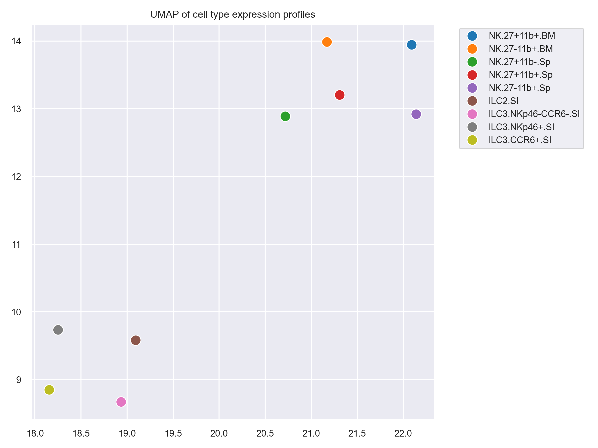
<p class="caption"> <b>Fig. 19.</b> UMAP by cell type using RNA-seq data</p>
</div>

<div class="figure" style="text-align: center">
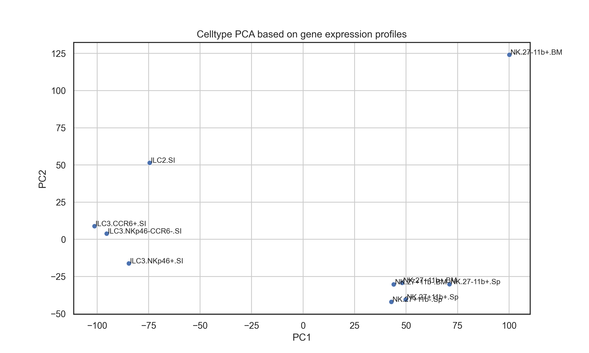
<p class="caption"> <b>Fig. 20.</b> PCA by cell type using RNA-seq data</p>
</div>

Then we used log2-Fold and z-score of expression profile to find the most variable genes in ILC compared to all other cell types. The results can be seen on this heatmap. 

<div class="figure" style="text-align: center">
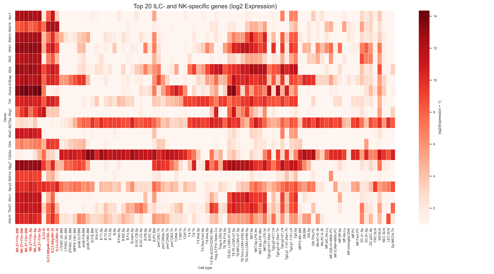
<p class="caption"> <b>Fig. 21.</b> Top 20 ILC specific genes based on Gene Expression profile</p>
</div>

To find subclusters of special interest between our cell subtypes, we calculated the z-score after transforming the RNA-seq data with log2. We visualized the results with a heatmap and used hierarchical clustering to show possible subclusters. The results were expected and comparable with the k-means clustering in UMAP and PCA. ILC clusters together and so do NK cells. 

<div class="figure" style="text-align: center">
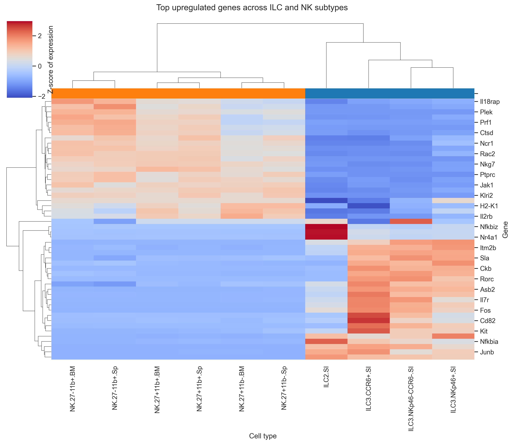
<p class="caption"> <b>Fig. 22.</b> Top upregulated Genes across ILC subtypes </p>
</div>

<div class="figure" style="text-align: center">


<p class="caption"> <b>Fig. 23.</b> Clustering of ILC and NK cells based on OCRs (left) or gene expression (right)</p>
</div>

The cell lineages are clustered based on their peaks in the right figure. PC1 clearly separates NK and ILC cells, while PC2 distinguishes ILC2 from ILC3. While PCA analysis based on gene expression (left) show a similar separation of lineages, with a more clear distinction for a certain type of NK cells (NK.27-11b+.BM).

## Correlation Analysis between CREs and Gene Expression

After analyzing the RNA-seq and ATAC-seq data separately, the next step was to see how well both data correlate and analyze the distance between OCRs and Genes. First, we associated gene expression to CREs based on genomic distance and correlation. We used Pearson Correlation. We found out there are 98593 OCRs associated with genes. The following Histogram shows us in which genomic category these CREs are located by differentiating between activating and repressing CREs. 

<div class="figure" style="text-align: center">
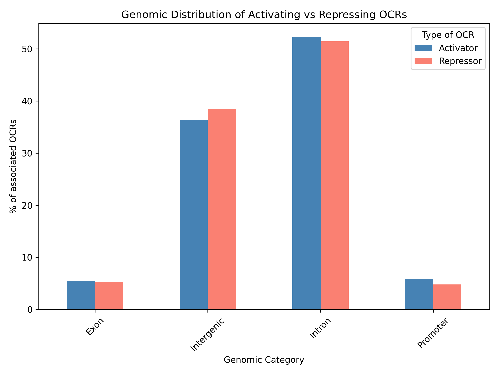
<p class="caption"> <b>Fig. 24. </b> Genomic Distibution of activating vs repressing CREs</p>
</div>

OCRs are mostly located in introns or intergenic genome sequences.
This information can also be proved in the plot comparing the distance between TSSs and OCRs.

<div class="figure" style="text-align: center">
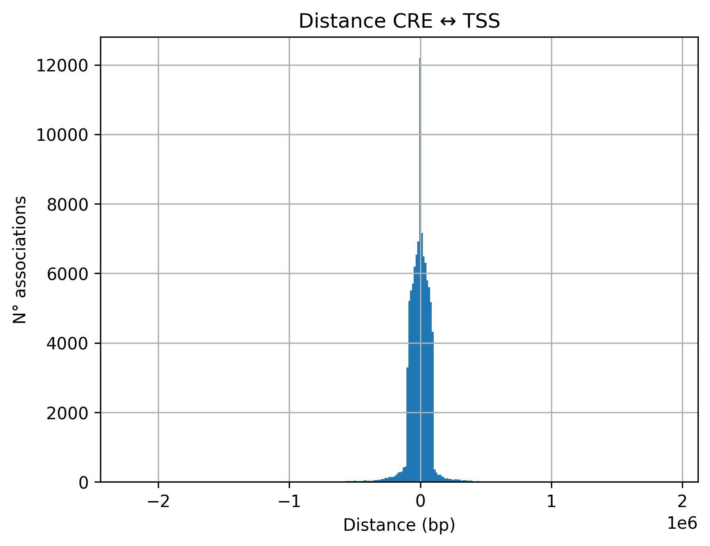
<p class="caption"> <b>Fig. 25. </b> Distance between CREs and the nearest TSS</p>
</div>

We filtered for positive Pearson correlations between accessibility signals and expression profiles, this way we are only analyzing activating CREs that act as enhancers and promoters. There are 49990 positive associated OCRs to genes with an average correlation 0.37, this value proves that Activators elevate gene expression as expected. Filtering for negative correlations showed us that there are 48602 OCRs that negatively regulate Genes with an average correlation of -0.29. 
We used a heatmap to portray the Gene-OCR with the highest Correlation.

<div class="figure" style="text-align: center">
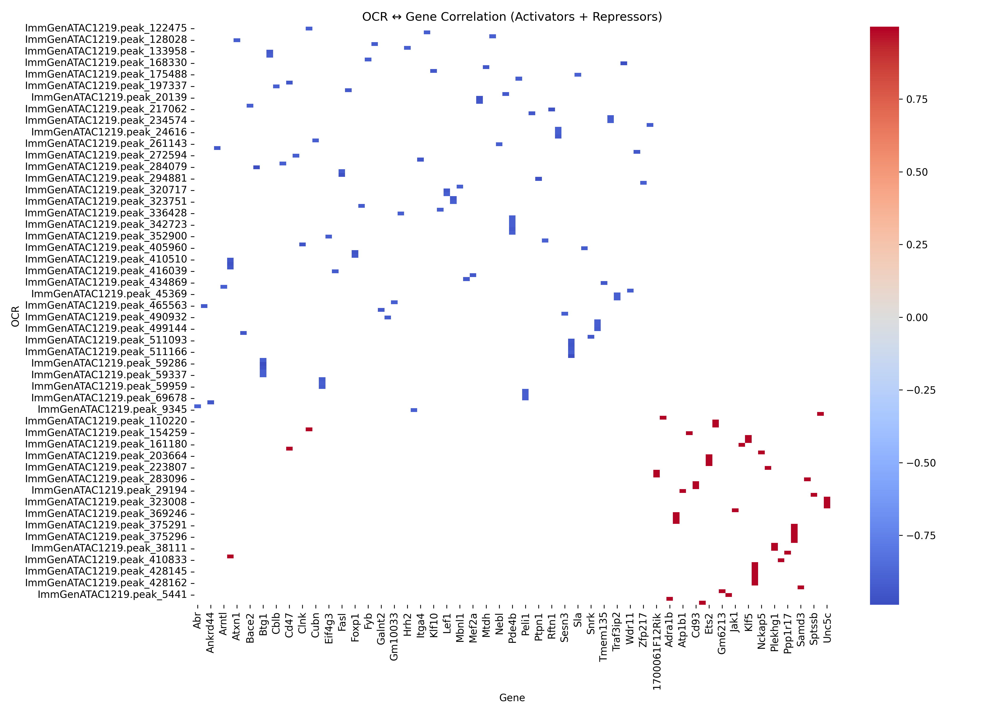
<p class="caption"> <b>Fig. 26. </b> Highest OCR-Gene Association</p>
</div>

We wanted to see where the most associated CREs to each gene were located. The Histogram shows the genomic category of all Top OCR-Gene Associations. Most are located on Introns or intergenic non-coding sequences. 

<div class="figure" style="text-align: center">
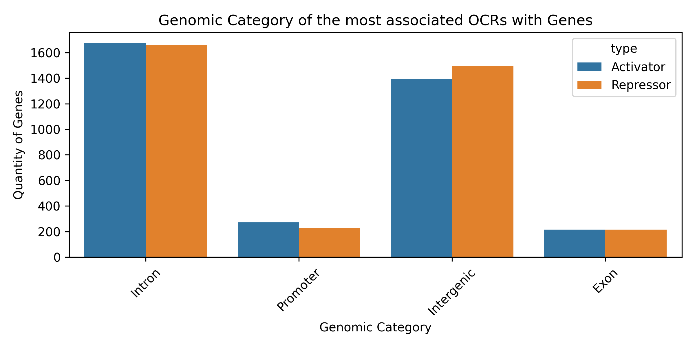
<p class="caption"> <b>Fig. 27. </b> Genomic Categories of the most associated CREs</p>
</div>

Later we counted how many associated CREs are located in promoter regions. The following pie chart shows the genomic category for both activators and repressors. Only 5.8% of associated CREs are located on promoters. 

<div class="figure" style="text-align: center">
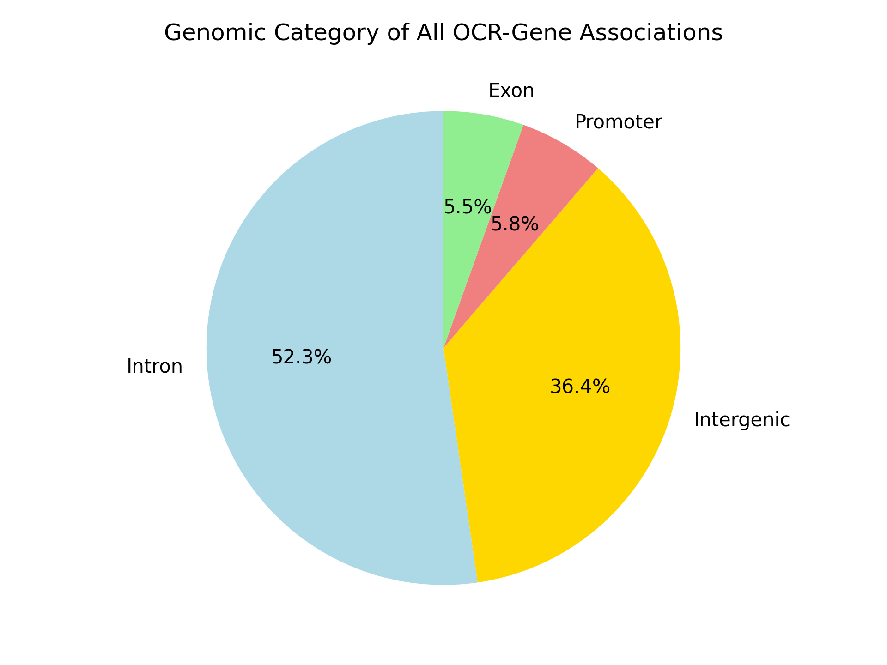
<p class="caption"> <b>Fig. 28. </b> Genomic Categories of all OCR-Gene Association</p>
</div>

We also counted the amount of Genes associated with promoters. There are only 1833 Genes with CREs on their Promoters, this means that not all Genes associate with a promoter. This could be because the promoter was not accessible by the time of the measurements and blocked by transcription factors, or the other genes are regulated by distal CREs like Repressors and Enhancers. There are also no promoters that associate with more than one gene.

Most of the closest associated Activators to each gene are located on promoters, but there are still 2315 Genes that do not have a promoter as most associated Activator, which means they are regulated by distal enhancers. Closest associated repressors are located in Intron or Intergenic genome sequences. The following chart summarizes the location of the closest associated CREs including Repressors and Activators.

<div class="figure" style="text-align: center">
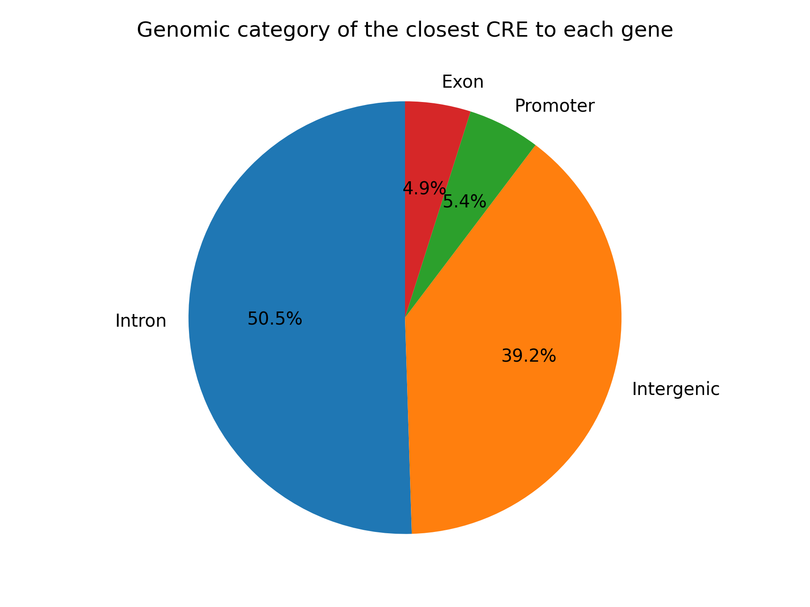
<p class="caption"> <b>Fig. 29. </b> Genomic Categories of the closest associated CREs to ech Gene</p>
</div>

Lastly, we wanted to see if Genes were regulated by more than one CRE. We counted how many CREs were associated with each gene and found out that there are genes with complex regulatory networks like Foxp1 with 383 associated Activators and 157 associated Repressors. However, most genes are only associated to a small amount of CREs.

<div class="figure" style="text-align: center">
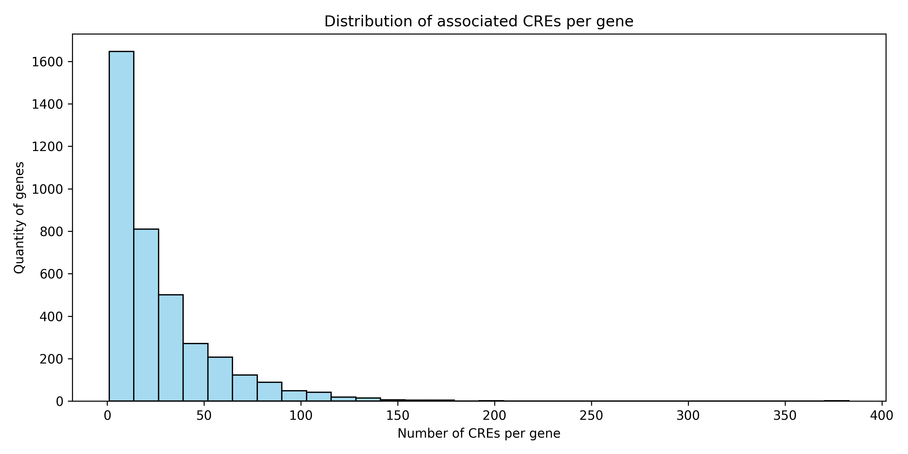
<p class="caption"> <b>Fig. 30. </b> Distribution of associated CREs per Gene</p>
</div>

## Regression analysis

<div class="figure" style="text-align: center" id="fig31">

<p class="caption"> <b>Fig. 31.</b> Distribution of Variance Explained by CREs in the Global Model</p>
</div>

We fitted a multivariate linear model for each gene using all CREs within ±100 kb as predictors. The distribution of global $R^2$-values [(Fig. 31)](#fig31) shows a median of 0.97, indicating that the variance in gene expression across the immune cell types can be nearly completely explained by nearby chromatin accessibility for a lot of genes. 

<div class="figure" style="text-align: center" id="fig32">

<p class="caption"> <b>Fig. 32.</b> Distribution of difference in CRE effect size between Global Model and ILC-only Model</p>
</div>

By refitting the same model using only ILC samples, we observed systematic shifts in CRE effect sizes ($\Delta \beta = \beta_{\text{ILC}} − \beta_{\text{Global}}$) [(Fig. 32)](#fig32). The mean $\Delta \beta$ is near zero, but the distribution has heavy tails, indicating that some CREs gain or lose substantial influence when focusing on the ILC lineage.

<div class="figure" style="text-align: center" id="fig33">

<p class="caption"> <b>Fig. 33.</b> Heatmap of Top 20 genes with the largest variance explained difference between the models to their linked CREs</p>
</div>

We ranked genes by the increase in explained variance ($\Delta R^2 = R^2_{\rm ILC} - R^2_{\rm Global}$​). The top 20 genes show an average $\Delta R^2$ of 0.96. Heat‑mapping their linked CREs’ $\Delta\beta$ [(Fig. 33)](#fig33) reveals modules of peaks that become uniquely activating in ILCs—strong candidates for lineage‑defining enhancers.

<div class="figure" style="text-align: center" id="fig34">

<p class="caption"> <b>Fig. 34.</b> Scatterplot of CREs effect size vs Pearson correlation model</p>
</div>

Comparing multivariate coefficients ($\beta_{\rm Global}$​) to univariate Pearson’s $r$ [(Fig. 34)](#fig34) yields a very low correlation (Pearson $\rho$ ≈ 0.005).

<div class="figure" style="text-align: center" id="fig35">

<p class="caption"> <b>Fig. 35.</b> Count of CREs classified by Effect Size</p>
</div>

We classify CREs by the sign of their global $\beta$: activating ($\beta>0.1$) vs repressing ($\beta<−0.1$). Activators comprise 45.1 % of CREs, while repressors are 43.9 % [(Fig. 35)](#fig35), suggesting that activation and repression possess similar importance in regulation.

<div class="figure" style="text-align: center">

<p class="caption"> <b>Fig. 36.</b> Piechart of dominant regulatory Effect percentage of the CREs per Gene</p>
</div>

For each gene, we determine whether the majority of its CREs are activating or repressing. Approximately 38.5 % of genes are predominantly repressed, indicating that repression can be the primary mode of expression control for a significant gene subset.

<div class="figure" style="text-align: center">
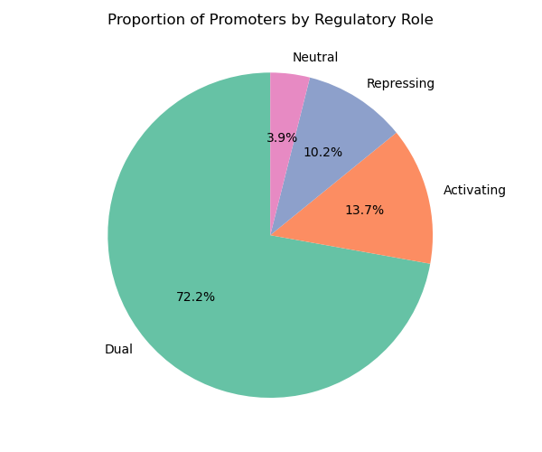
<p class="caption"> <b>Fig. 37.</b> Piechart of Regulatory Effect roles percentage of Promoters</p>
</div>

Approximately 10.2 % of promoters carry a predominantly repressing role, while 72.2 % can act either repressing or activating. 

<div class="figure" style="text-align: center" id="fig38">


<p class="caption"> <b>Fig. 38.</b> Distribution of activating and repressing roles in Promoters/Enhancers and in intragenic/extragenic Enhancers</p>
</div>

Repressing and activating CREs have the same likelihood to lie intragenically (45.7 %),  but repressing CREs are slightly less enriched at promoters (57.6 % vs 59.3 % for activators) [(Fig. 38)](#fig38). This suggests that promoter‑proximal sites slightly favor activating regulatory roles.

<div class="figure" style="text-align: center">

<p class="caption"> <b>Fig. 39.</b> Piechart of Regulatory Effect roles percentage of the CREs</p>
</div>

We find that 52.5 % of CREs serve both activating and repressing roles across different target genes. These dual‑role elements may integrate complex regulatory logic or reflect context‑dependent factor binding.

<div class="figure" style="text-align: center">

<p class="caption"> <b>Fig. 40.</b> UMAP plots: Top left- clustering of associated peaks based on accessibility profiles; Bottom- hexbin plots that shows the distribution of activators compared to repressors with the same UMAP embedding; Top right- clustering after assigning each peak an additional dimension (as activator +1 or repressor -1)</p>
</div>

Clustering based solely on accessibility patterns for peaks that correlate to gene expression. Roughly 100.000 peaks from the 500.000 can be certainly classified as CREs based on correlation analysis. From the UMAP 4 clusters can be seen. The largest blue one represents the majority of CREs so it represents the “default” accessibility pattern among peaks that correlate with expression. 
These two hexbin plots are showing the smoothed density of activator‐linked CREs (left) versus repressor‐linked CREs (right) in the same UMAP embedding (which was built only from accessibility).Because both activators and repressors sit in largely the same UMAP cloud, accessibility patterns alone do not perfectly separate activating vs. repressing CREs. 
- Clustering the associated peaks shows a similar accessibility profiles for activators and repressors.
- Re-clustering the peaks after assigning them direction (as activators or repressors) slightly changes the output showing that effect direction can to some extent separate regulatory niches.
- The small differences lead to the conclusion that both activating and repressing CREs might act together to manage a robust regulatory network.
- Statistical testing (such as Fischer's exact and χ²) confirmed the non-random distribution of CREs across clusters, while a high ARI index and a small shift in the activator/repressor fractions after re-clustering point to only modest re-partitioning of the original accessibility-based groups.


# Discussion

Our Integrative analysis of the ATAC-seq and RNA-seq data reveals a complex regulatory architecture in ILCs. 

While most of the CREs are located in intronic or intergenic regions, we also found that the ones located in Promoters have a significantly higher correlation with gene expression. Our results also show that activating and repressing CREs co-localize, but take over different regulatory niches in the regulatory space, adding a new additional functional dimension to Chromatin Accessibility. 

Surprisingly, we did not find any promoters associated with more than one gene, suggesting a high level of one to one specificity on this cell type. We also detected genes with complexe regulatory networks, regulated by multiple CREs, which can be related to essential functions or specific activation contexts. 

We also found out that it is possible to cluster cell types based on ATAC-seq or RNA-seq alone and find cell lineage specific genes that could be crucial to determine the biological importance of ILCs compared to other immune cell types. By clustering we found out that ILC2 cells formed a distinct group, unlike the ILC3 and NK cell populations, which formed subclusters. This suggests that ILC2s differentiates from other ILCs. 

It would be interesting to analyze gene expression and ATAC Signals when ILCs are activated or in inflammatory conditions to see if there are any changes in the results. 

In Conclusion, our findings contribute to a deeper understanding of the gene regulation of ILCs and set the ground information for further functional and comparative research. 


# References

- <a id="1">[1]</a> Kim S, Wysocka J. Deciphering the multi-scale, quantitative cis-regulatory code. Mol Cell. 2023 Feb 2;83(3):373-392. Epub 2023 Jan 23. PMID: 36693380; PMCID: PMC9898153. https://doi.org/10.1016/j.molcel.2022.12.032
- <a id="2">[2]</a> Yoshida, H., et al. (2019). The cis-Regulatory Atlas of the Mouse Immune System. Cell, 176(4), 897–912.e20. https://doi.org/10.1016/j.cell.2018.12.036
- <a id="3">[3]</a> Grandi FC, Modi H, Kampman L, Corces MR. Chromatin accessibility profiling by ATAC-seq. Nat Protoc. 2022 Jun;17(6):1518-1552. Epub 2022 Apr 27. PMID: 35478247; PMCID: PMC9189070. https://doi.org/10.1038/s41596-022-00692-9
- <a id="4">[4]</a> Buenrostro, J. D., Wu, B., Chang, H. Y., & Greenleaf, W. J. (2015). ATAC-seq: A Method for Assaying Chromatin Accessibility Genome-Wide. Current Protocols in Molecular Biology, 109, 21.29.1–21.29.9. https://doi.org/10.1002/0471142727.mb2129s109
- <a id="5">[5]</a> Jacquelot N, Seillet C, Vivier E, Belz GT. Innate lymphoid cells and cancer. Nat Immunol. 2022 Mar;23(3):371-379. Epub 2022 Feb 28. PMID: 35228695. https://doi.org/10.1038/s41590-022-01127-z
- <a id="6">[6]</a> Clottu AS, Humbel M, Fluder N, Karampetsou MP, Comte D. Innate Lymphoid Cells in Autoimmune Diseases. Front Immunol. 2022 Jan 7;12:789788. PMID: 35069567; PMCID: PMC8777080. https://doi.org/10.3389/fimmu.2021.789788
- <a id="7">[7]</a> Crinier A, Narni-Mancinelli E, Ugolini S, Vivier E. SnapShot: Natural Killer Cells. Cell. 2020 Mar 19;180(6):1280-1280.e1. PMID: 32200803. https://doi.org/10.1016/j.cell.2020.02.029
- <a id="8">[8]</a> Image source: https://www.addgene.org/mol-bio-reference/promoters/
- <a id="9">[9]</a> Vivier, E., Artis, D., Colonna, M., Diefenbach, A., Di Santo, J. P., Eberl, G., Koyasu, S., Locksley, R. M., McKenzie, A. N. J., Mebius, R. E., Powrie, F., & Spits, H. (2018). Innate Lymphoid Cells: 10 Years On. Cell, 174(5), 1054–1066. https://doi.org/10.1016/j.cell.2018.07.017

# Repository Usage and Structure

To download the data files we used and setup the structure for the data processing run the [00_setup.ipynb](00_setup.ipynb) notebook. This will automatically download the necessary files and create additional folders. If a download fails for some reason you can manually download them and place them in the **data/** directory.

Some notebooks use processed data other notebooks. If a data file isn't found during execution try running a previous notebook first (especially [02_tss_analysis.ipynb](02_tss_analysis.ipynb) and [08_regression_modelling.ipynb](08_regression_modelling.ipynb)).

## Conda Environment
To ease reproducibility of the jupyter notebooks we suggest using **conda** to install all the packages that were used in this project. For this you can use the following instructions to setup the working environment we used. All used python packages can be found and setup using the [environment.yml](environment.yml).
### Conda Setup
To create the conda environment run
```shell
conda env create -f environment.yml
```
or update it using
```shell
conda env update --file environment.yml --prune
```

To test if the environment was installed successfully use
 ```shell
 conda activate data_analysis
 conda list
 ```
 
### Installing new packages
First make sure that you have the current version of **environment.yml** by syncing via the Source Control tab in VS Code. Then update your conda environment to the newest version by running
```shell
conda env update --file environment.yml --prune
```
in the terminal. After this you can install a new package by executing
```shell
conda activate data_analysis
conda install *thepackageyouwanttoadd*
```  
If the installation was successful you can now update the **environment.yml** via
```shell
conda export --no-builds -f environment.yml
```
Then commit (stating the package(s) you added) and sync the updated **environment.yml**.

## File structure
```text
├───data                    - raw data
├───data-processed          - data processed by jupyter notebooks
├───figures                 - external figures used in the readme
├───plots                   - plots generated by jupyter notebooks
│   ├───Clustering_RNA-seq
│   ├───Correlation
│   ├───qc
│   ├───regression
│   └───tss
├───Question 1. iv          - jupyter notebooks for question 1. iv
└───Question_1_iii          - jupyter notebooks for question 1. iii
```
