# Introduction
The differentiation of gene expression allows multicellular organisms to generate a broad variety of cell types and tissue from the same genome. This regulation is mediated by complex nets of transcriptional factors and regulatory elements that work in a coordinated way. Cis-regulatory elements (CREs) are part of this elements, specific regions of the genome that can influence the transcription of nearby genes or even faraway located genes. The promoters, located around the transcription start site (TSS) and enhancers, that can be located hundred kb of distance, are examples of CREs that modulate gene activity. 

The sequencing technology of RNA-seq allows to quantify gene expression in great scale, meanwhile the sequencing of accessible chromatin (ATAC-seq) allows a direct vision of the regions of the genome that are open and potentially active in regulatory pathways. The integration of both technologies allows to establish causal relationships between chromatin accessibility and gene expression, revealing regulatory mechanisms for specific cell lineages. 

In this project, we analyzed data from RNA-seq and ATAC-seq of innate lymphoid cells to characterize their regulatory landscape. We analyzed correlation and genomic distance, and modeled regression to answer key questions about how CRES influence gene expression, how they organize spatially in connection to TSSs and how specific these elements are for every cell type. Our goal was to identify regulatory profiles that define cell identity and allow to understand the mechanisms that control differentiation and function of this immune cells.

# Readme.docx

## The gene regulatory network

Understanding how gene expression is controlled by the genome is crucial in biology. This involves decoding the cis-regulatory code, which describes how DNA sequences determine when, where, and how much each gene is transcribed in a given state of differentiation. Unlike the genetic code, which is universal and modular, the cis-regulatory code is often influenced by interactions across large genomic regions (4).

Central in this system are cis-regulatory elements (CREs), which are non-coding regions of the genome that control the transcription of nearby genes. These elements include promoters, which are located close to transcription start sites and serve as initiation points for transcription, and enhancers, which can be located far from their target genes and modulate transcription in a context-dependent manner. Enhancers often act in combinations and are activated or repressed by specific transcription factors, shaping gene expression patterns. (2)

Together, CREs form part of a broader gene regulatory network (GRN), which defines how genes are turned on or off across different cellular states and therefore define cell differentiation.

<div class="figure" style="text-align: center">
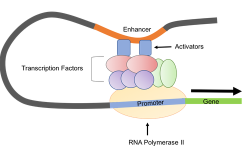
<p class="caption"> <b>Fig. 1.</b> Cis regulatory elements on the DNA strand (8) (https://www.addgene.org/mol-bio-reference/promoters/) </p>
</div>

Gene expression and therefore cell differentiation is also controlled, by the accessibility of certain regions in the genome. Therefore, the analysis of those open chromatin regions (OCRs) is crucial to understand differentiation and relationships between cell types. ATAC-seq (Assay for Transposase-Accessible Chromatin using sequencing) is a powerful method for profiling genome-wide chromatin accessibility. It utilizes a hyperactive Tn5 transposase that inserts sequencing adapters into regions of open, nucleosome-free chromatin. These accessible regions often correspond to regulatory DNA elements such as promoters, enhancers, and other cis-regulatory sequences actively involved in transcriptional control. (3)

RNA sequencing (RNA-seq) is a high-throughput technique that allows for comprehensive and quantitative analysis of the transcriptome. It enables the detection and quantification of gene expression across all transcribed genes within a cell. This has made RNA-seq an essential tool in functional genomics, cell differentiation studies, and disease research, where understanding transcriptional output is key to identifying regulators of cellular identity and function (4).

By linking chromatin accessibility to transcriptional states, ATAC-seq and RNA seq serve as a efficient technique in decoding the regulatory network of the genome and therefore analyse cell differentiation and relationships between closely related cells.

<div class="figure" style="text-align: center">
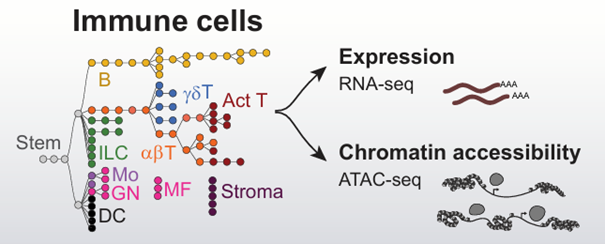
<p class="caption"> <b>Fig. 2.</b> Analysis of Immune cell types through combining RNA- seq and ATAc-seq (2) (Yoshida et al. 2019) </p>
</div>

We will use this information, to determine differences and similarities of the chromatin landscape between immune cells and determine the relationship between the chromatin landscape and gene expression. In the end, we aim to establish a cis-regulatory atlas that is identity driven and verify known relationships between cells according to the accessibility of cis regulatory elements. In our analyses, we focus on Natural killer cells and Innate lymphoid cells.

## Innate lymphoid cells (ILC) and Natural Killer cells (NK)

ILCs are a heterogenic set of immune cells that play crucial roles in early defence mechanisms against bacteria, virus and transformed cells. They are primarily tissue-resident and strongly shaped by the characteristics of their local tissue environment, which are the skin, liver, airways, lymph nodes, and the gastrointestinal tract. (5) The main subgroups of ILCs—ILC1, ILC2, and ILC3— share similarities with TH1, TH2 and TH17 cells in regard to signalling molecules they release, which helps shape immune responses and maintain tissue balance (6). 

Natural killer (NK) cells are closely related to ILCs but are unique in their ability to directly destroy infected or abnormal cells. NK cells develop through several stages, each marked by different surface proteins and transcription factors, and gradually acquire the tools needed for surveillance and cytotoxicity(7). NK cells originate in the bone marrow (BM) and progress through stages marked by CD27 and CD11b expression, transitioning from NK.27+11b−.BM to NK.27+11b+.BM and NK.27−11b+.BM. These subsets also appear in the spleen (Sp), indicating migration and continued maturation. (Yoshida figure).

<div class="figure" style="text-align: center">
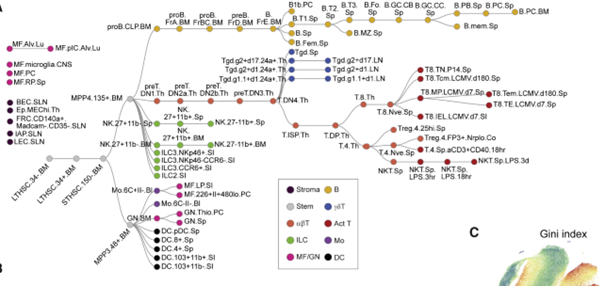
<p class="caption"> <b>Fig. 3.</b> Differentiation of immune cells (2) (Yoshida et al. 2019) </p>
</div>

## Data sets

The ATAC-seq data set includes the OCR samples and their chromatin accessibility values across the immune cell types, as well as their location in the genome and quality parameters. We will use this information to identify the relationship between ILC and NK subtypes according to their ATAC signal and vice versa analyse classes of peaks according to their similarities.

The RNA-seq data set shows the gene expression levels in the immune cell types for different genes. Analysing gene expression can verify the known relationships between ILC and NK subtypes, aswell as pointing up their differences.

The third data set adds metadata and quality metrics to the ATAC-seq data and can be used to validate data quality and filter out low quality samples before the analysis.
The last data set contains detailed information about gene structure and the position of genes in the genome. This will be used to map OCRs to certain genes and differentiate between different types of CREs, like promotors and enhancers

## References

1. Kim S, Wysocka J. Deciphering the multi-scale, quantitative cis-regulatory code. Mol Cell. 2023 Feb 2;83(3):373-392. doi: 10.1016/j.molcel.2022.12.032. Epub 2023 Jan 23. PMID: 36693380; PMCID: PMC9898153
2. Yoshida, H., et al. (2019). The cis-Regulatory Atlas of the Mouse Immune System. Cell, 176(4), 897–912.e20. https://doi.org/10.1016/j.cell.2018.12.036
3. Grandi FC, Modi H, Kampman L, Corces MR. Chromatin accessibility profiling by ATAC-seq. Nat Protoc. 2022 Jun;17(6):1518-1552. doi: 10.1038/s41596-022-00692-9. Epub 2022 Apr 27. PMID: 35478247; PMCID: PMC9189070
4. Buenrostro, J. D., Wu, B., Chang, H. Y., & Greenleaf, W. J. (2015). ATAC-seq: A Method for Assaying Chromatin Accessibility Genome-Wide. Current Protocols in Molecular Biology, 109, 21.29.1–21.29.9.
5. Jacquelot N, Seillet C, Vivier E, Belz GT. Innate lymphoid cells and cancer. Nat Immunol. 2022 Mar;23(3):371-379. doi: 10.1038/s41590-022-01127-z. Epub 2022 Feb 28. PMID: 35228695.
6. Clottu AS, Humbel M, Fluder N, Karampetsou MP, Comte D. Innate Lymphoid Cells in Autoimmune Diseases. Front Immunol. 2022 Jan 7;12:789788. doi: 10.3389/fimmu.2021.789788. PMID: 35069567; PMCID: PMC8777080.
7. Crinier A, Narni-Mancinelli E, Ugolini S, Vivier E. SnapShot: Natural Killer Cells. Cell. 2020 Mar 19;180(6):1280-1280.e1. doi: 10.1016/j.cell.2020.02.029. PMID: 32200803.
8. Image source:https://www.addgene.org/mol-bio-reference/promoters/
9. 

# Results

## Quality Control

<div class="figure" style="text-align: center">
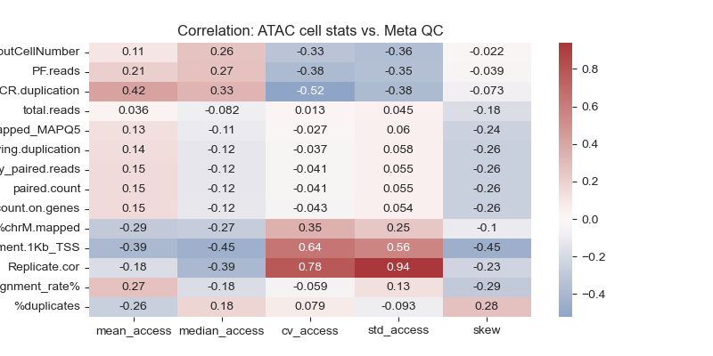
<p class="caption"> <b>Fig. n.</b> Correlation heatmap of cell-type statistics to QC metrics</p>
</div>

We computed per‑sample (cell‑type) statistics — mean, median, and standard deviation of peak accessibility — and compared these to library QC metrics (total reads, duplication rate, TSS‑enrichment, etc.). There is no clear unexpected relationship in the above analysis so we will work with all of the cell types.

<div class="figure" style="text-align: center">
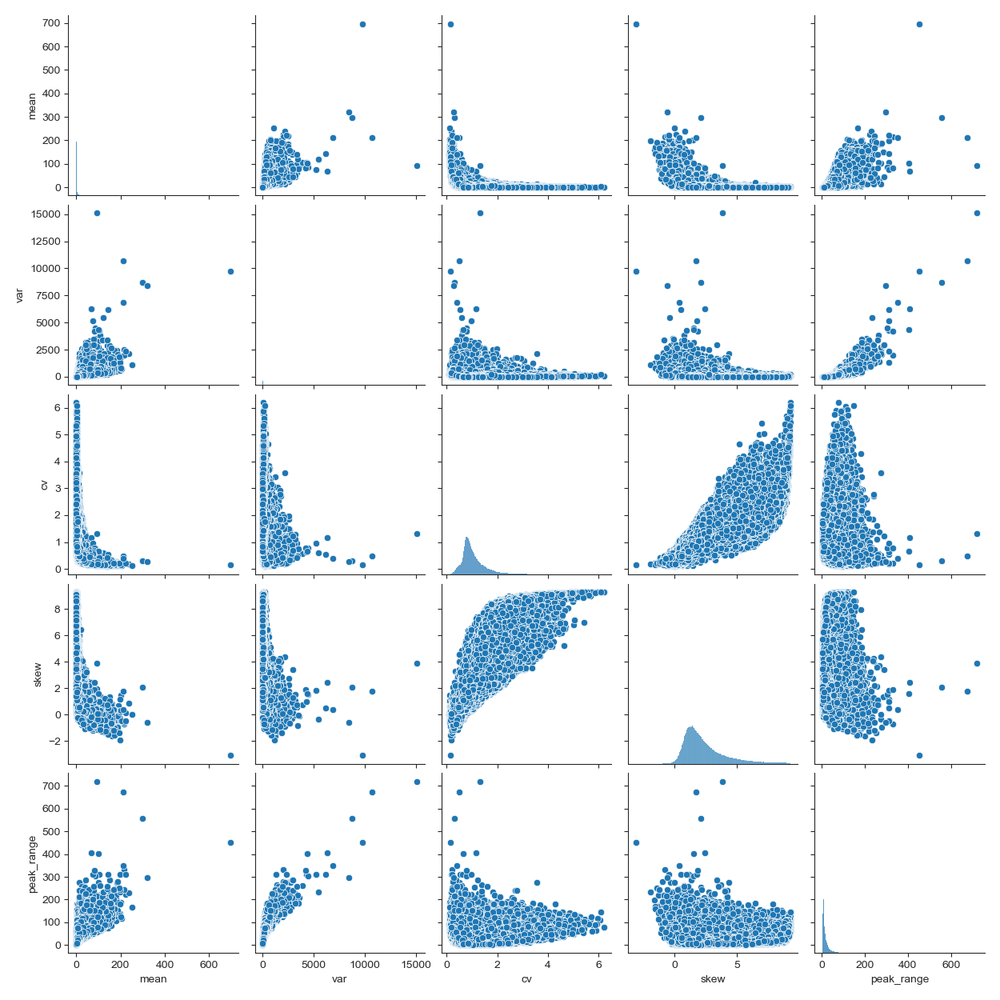
<p class="caption"> <b>Fig. n.</b> Pairplot of per ATAC-peak statistics against each other</p>
</div>

For each CRE, we computed mean, range (max–min), variance, coefficient of variation (std/mean), and skewness across cell types. There were no clear outliers, so no peaks were excluded from further analysis.

## Transcription Start Site analysis

<div class="figure" style="text-align: center">
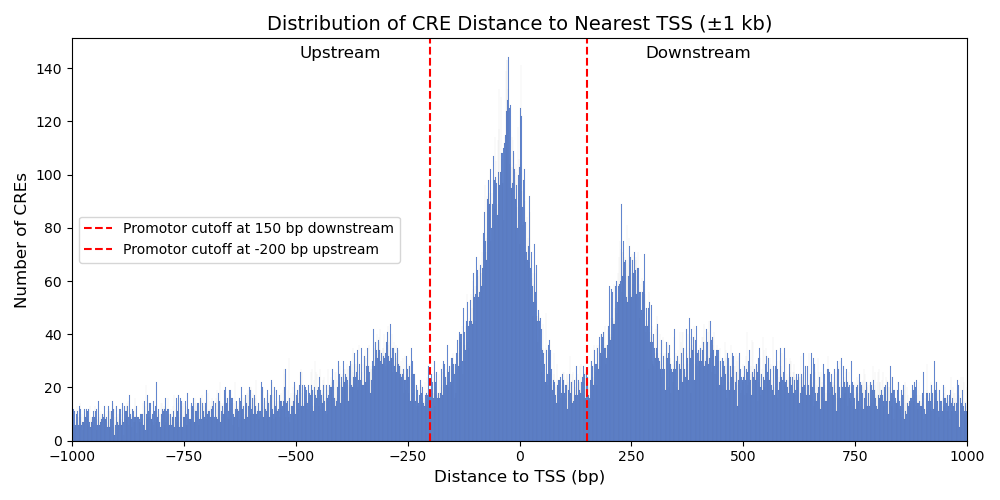
<p class="caption"> <b>Fig. n.</b> Distribution of Open Chromatin Region distance to nearest Transcription Start Site</p>
</div>

The distance of Open Chromatin Regions to their nearest Transcription Start Site roughly follows a normal distribution with some significant peaks up- and downstream at around *300 bp* from the TSS.


<div class="figure" style="text-align: center">
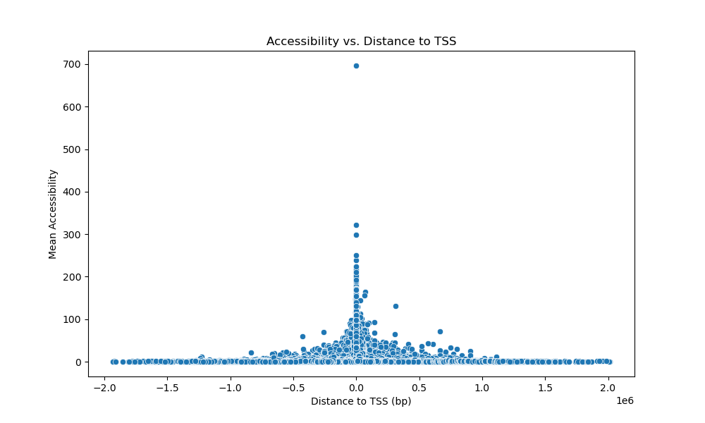
<p class="caption"> <b>Fig. n.</b> Scatterplot of accessibility vs Transcription Start Site distance</p>
</div>

A scatter of mean accessibility versus distance reveals a decaying trend: peaks closer to the TSS tend to be more accessible.


<div class="figure" style="text-align: center">
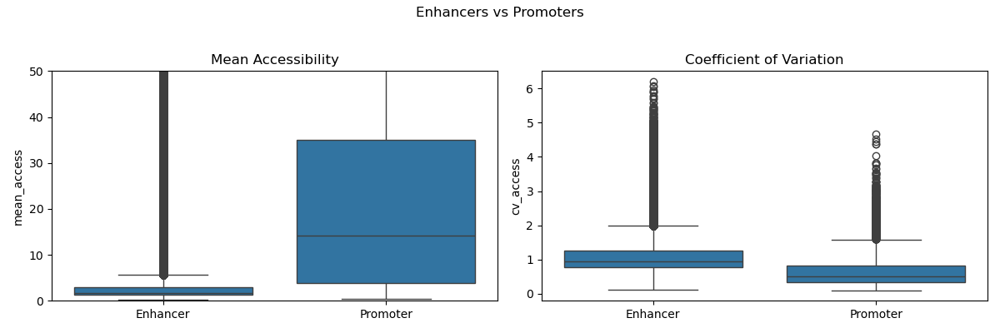
<p class="caption"> <b>Fig. n.</b> Barplot of Promoter and Enhancer mean/variation of accessibility</p>
</div>

Promoter peaks (-200bp to +150 bp of TSS) exhibit higher mean and lower variance than distal enhancers (t-test p = 0, Figure X).

- Promoters: median mean = 14.19, CV = 1.17
- Enhancers: median mean =1.72, CV = 1.63

This clear separation justifies treating promoters and enhancers separately in feature filtering and clustering.

<div class="figure" style="text-align: center">
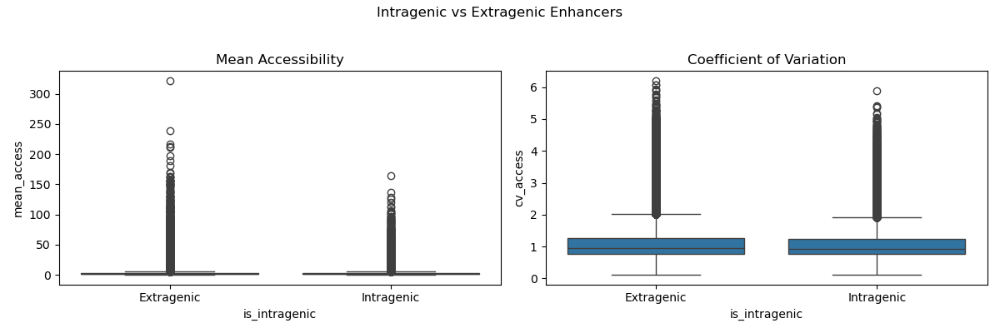
<p class="caption"> <b>Fig. n.</b> Barplot of intragenic and extragenic Enhancer mean/variation of accessibility</p>
</div>
Comparing intronic enhancers (within gene bodies) to intergenic enhancers shows:

- Intronic: higher average signal (median = 1.73) and lower spread (CV = 1.39). slight downstream bias in distance distribution (Figure X).
- Intergenic: broader distance spread (CV = 1.76) and lower average signal (median = 1.70).

These patterns suggest intronic enhancers are often more dynamic but also potentially more context‑specific than distal elements.

<div class="figure" style="text-align: center">
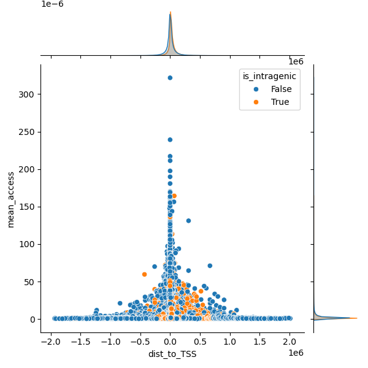
<p class="caption"> <b>Fig. n.</b> Scatterplot of enhancer accessibility vs Transcription Start Site distance classified by location</p>
</div>

## Regression analysis

<div class="figure" style="text-align: center">
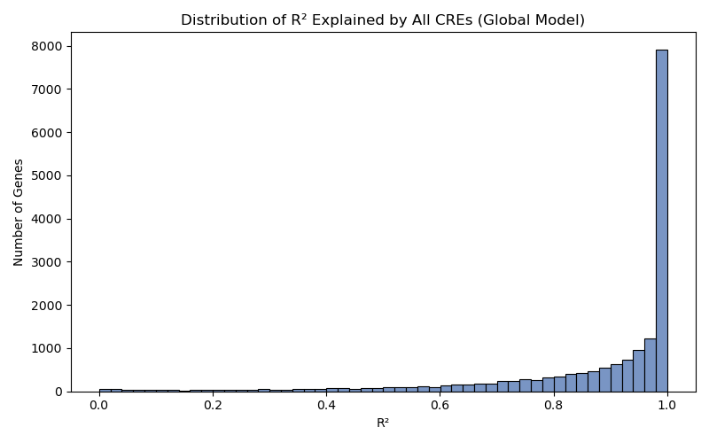
<p class="caption"> <b>Fig. n.</b> Distribution of Variance Explained by CREs in the Global Model</p>
</div>

We fitted a multivariate linear model for each gene using all CREs within ±100 kb as predictors. The distribution of global $R^2$-values (Figure X) shows a median of 0.97, indicating that the variance in gene expression across the immune cell types can be nearly completely explained by nearby chromatin accessibility for a lot of genes. 

<div class="figure" style="text-align: center">
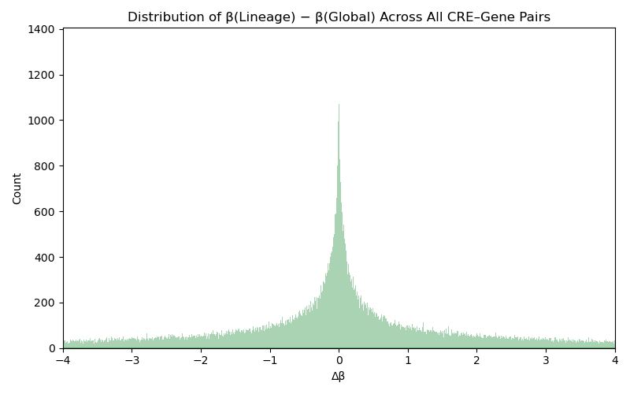
<p class="caption"> <b>Fig. n.</b> Distribution of difference in CRE effect size between Global Model and ILC-only Model</p>
</div>

By refitting the same model using only ILC samples, we observed systematic shifts in CRE effect sizes ($\Delta \beta = \beta_{\text{ILC}} − \beta_{\text{Global}}$) (Figure X). The mean $\Delta \beta$ is near zero, but the distribution has heavy tails, indicating that some CREs gain or lose substantial influence when focusing on the ILC lineage.

<div class="figure" style="text-align: center">
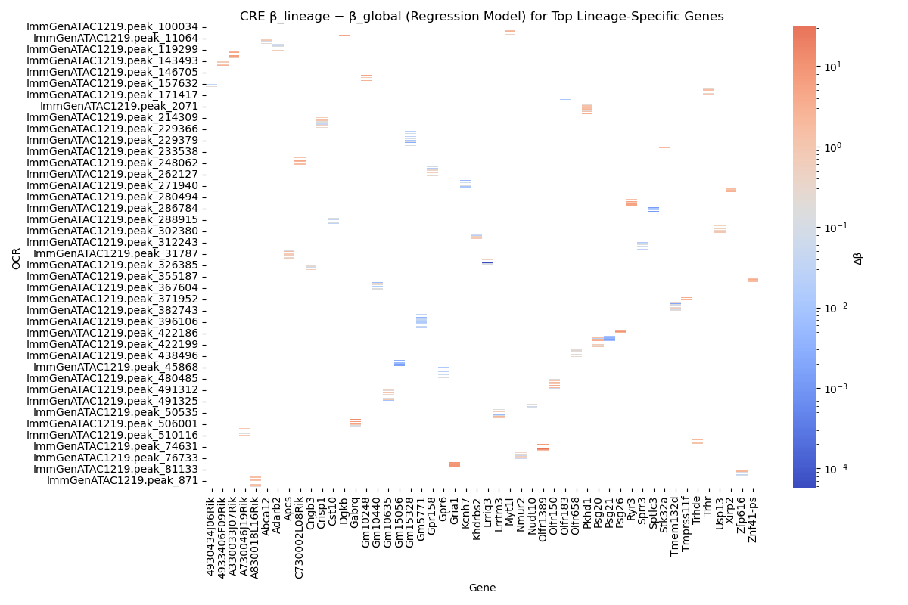
<p class="caption"> <b>Fig. n.</b> Heatmap of Top 20 genes with the largest variance explained difference between the models to their linked CREs</p>
</div>

We ranked genes by the increase in explained variance ($\Delta R^2 = R^2_{\rm ILC} - R^2_{\rm Global}$​). The top 20 genes show an average $\Delta R^2$ of 0.96. Heat‑mapping their linked CREs’ $\Delta\beta$ (Figure X) reveals modules of peaks that become uniquely activating in ILCs—strong candidates for lineage‑defining enhancers.

<div class="figure" style="text-align: center">
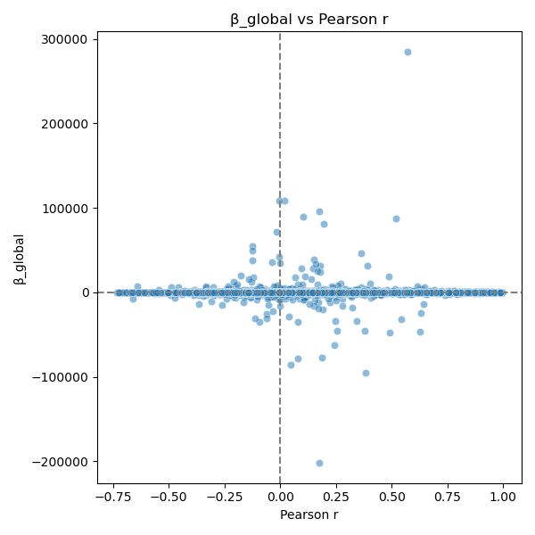
<p class="caption"> <b>Fig. n.</b> Scatterplot of CREs effect size vs Pearson correlation model</p>
</div>

Comparing multivariate coefficients ($\beta_{\rm Global}$​) to univariate Pearson’s $r$ (Figure X) yields a very low correlation (Pearson $\rho$ ≈ 0.005).

<div class="figure" style="text-align: center">
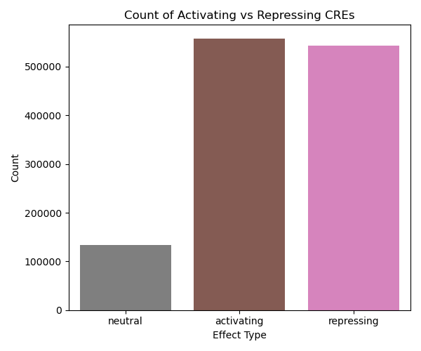
<p class="caption"> <b>Fig. n.</b> Count of CREs classified by Effect Size</p>
</div>

We classify CREs by the sign of their global $\beta$: activating ($\beta>0.1$) vs repressing ($\beta<−0.1$). Activators comprise 45.1 % of CREs, while repressors are 43.9 % (Figure X), suggesting that activation and repression possess similar importance in regulation.

<div class="figure" style="text-align: center">
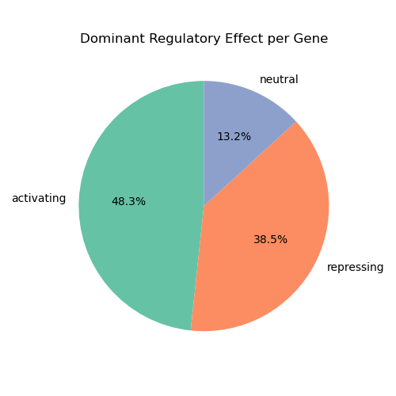
<p class="caption"> <b>Fig. n.</b> Piechart of dominant regulatory Effect percentage of the CREs per Gene</p>
</div>

For each gene, we determine whether the majority of its CREs are activating or repressing. Approximately 38.5 % of genes are predominantly repressed, indicating that repression can be the primary mode of expression control for a significant gene subset.

<div class="figure" style="text-align: center">
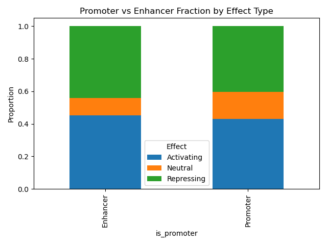
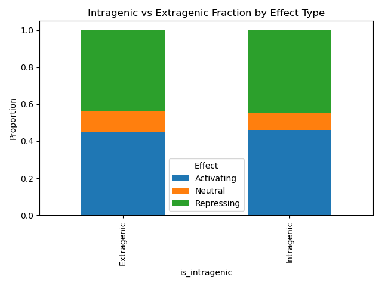
<p class="caption"> <b>Fig. n.</b> Distribution of activating and repressing roles in Promoters/Enhancers and in intragenic/extragenic Enhancers</p>
</div>

Repressing and activating CREs have the same likelihood to lie intragenically (45.7 %),  but repressing CREs are slightly less enriched at promoters (57.6 % vs 59.3 % for activators) (Figure X). This suggests that promoter‑proximal sites slightly favor activating regulatory roles.

<div class="figure" style="text-align: center">
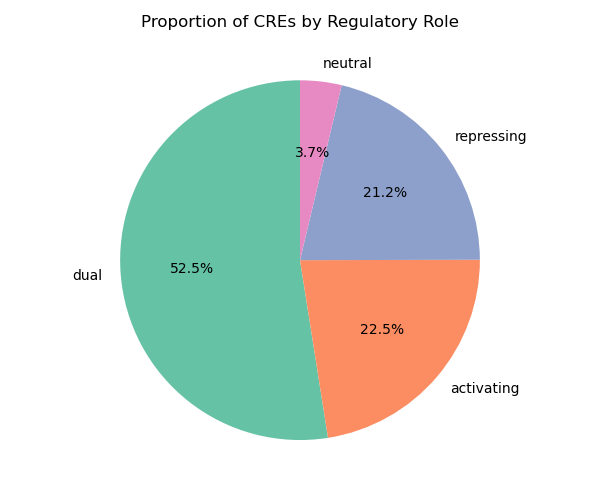
<p class="caption"> <b>Fig. n.</b> Piechart of Regulatory Effect roles percentage of the CREs</p>
</div>

We find that 52.5 % of CREs serve both activating and repressing roles across different target genes. These dual‑role elements may integrate complex regulatory logic or reflect context‑dependent factor binding.

# Conda Usage

## Conda Setup
To create the conda environment run
```
conda env create -f environment.yml
```
or update it using
```
conda env update --file environment.yml --prune
```

To test if the environment was installed successfully use
 ```
 conda activate data_analysis
 conda list
 ```
 
## Installing new packages
First make sure that you have the current version of *environment.yml* by syncing via the Source Control tab in VS Code. Then update your conda environment to the newest version by running
```
conda env update --file environment.yml --prune
```
in the terminal. After this you can install a new package by executing
```
conda activate data_analysis
conda install *thepackageyouwanttoadd*
```  
If the installation was successful you can now update the *environment.yml* via
```
conda export --no-builds -f environment.yml
```
Then commit (stating the package(s) you added) and sync the updated *environment.yml*.