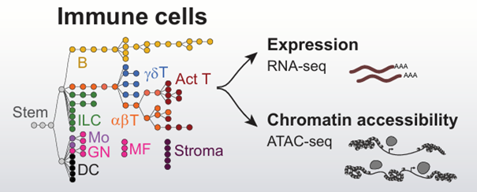

# Introduction
The differentiation of gene expression allows multicellular organisms to generate a broad variety of cell types and tissue from the same genome. This regulation is mediated by complex nets of transcriptional factors and regulatory elements that work in a coordinated way. Cis-regulatory elements (CREs) are part of this elements, specific regions of the genome that can influence the transcription of nearby genes or even faraway located genes. The promoters, located around the transcription start site (TSS) and enhancers, that can be located hundred kb of distance, are examples of CREs that modulate gene activity. 

The sequencing technology of RNA-seq allows to quantify gene expression in great scale, meanwhile the sequencing of accessible chromatin (ATAC-seq) allows a direct vision of the regions of the genome that are open and potentially active in regulatory pathways. The integration of both technologies allows to establish causal relationships between chromatin accessibility and gene expression, revealing regulatory mechanisms for specific cell lineages. 

In this project, we analyzed data from RNA-seq and ATAC-seq of innate lymphoid cells to characterize their regulatory landscape. We analyzed correlation and genomic distance, and modeled regression to answer key questions about how CRES influence gene expression, how they organize spatially in connection to TSSs and how specific these elements are for every cell type. Our goal was to identify regulatory profiles that define cell identity and allow to understand the mechanisms that control differentiation and function of this immune cells.

# Readme.docx

## The gene regulatory network

Understanding how gene expression is controlled by the genome is crucial in biology. This involves decoding the cis-regulatory code, which describes how DNA sequences determine when, where, and how much each gene is transcribed in a given state of differentiation. Unlike the genetic code, which is universal and modular, the cis-regulatory code is often influenced by interactions across large genomic regions (4).

Central in this system are cis-regulatory elements (CREs), which are non-coding regions of the genome that control the transcription of nearby genes. These elements include promoters, which are located close to transcription start sites and serve as initiation points for transcription, and enhancers, which can be located far from their target genes and modulate transcription in a context-dependent manner. Enhancers often act in combinations and are activated or repressed by specific transcription factors, shaping gene expression patterns. (2)

Together, CREs form part of a broader gene regulatory network (GRN), which defines how genes are turned on or off across different cellular states and therefore define cell differentiation.

<div class="figure" style="text-align: center">

<p class="caption"> <b>Fig. 1.</b> Cis regulatory elements on the DNA strand (8) (https://www.addgene.org/mol-bio-reference/promoters/) </p>
</div>

Gene expression and therefore cell differentiation is also controlled, by the accessibility of certain regions in the genome. Therefore, the analysis of those open chromatin regions (OCRs) is crucial to understand differentiation and relationships between cell types. ATAC-seq (Assay for Transposase-Accessible Chromatin using sequencing) is a powerful method for profiling genome-wide chromatin accessibility. It utilizes a hyperactive Tn5 transposase that inserts sequencing adapters into regions of open, nucleosome-free chromatin. These accessible regions often correspond to regulatory DNA elements such as promoters, enhancers, and other cis-regulatory sequences actively involved in transcriptional control. (3)

RNA sequencing (RNA-seq) is a high-throughput technique that allows for comprehensive and quantitative analysis of the transcriptome. It enables the detection and quantification of gene expression across all transcribed genes within a cell. This has made RNA-seq an essential tool in functional genomics, cell differentiation studies, and disease research, where understanding transcriptional output is key to identifying regulators of cellular identity and function (4).

By linking chromatin accessibility to transcriptional states, ATAC-seq and RNA seq serve as a efficient technique in decoding the regulatory network of the genome and therefore analyse cell differentiation and relationships between closely related cells.

<div class="figure" style="text-align: center">

<p class="caption"> <b>Fig. 2.</b> Analysis of Immune cell types through combining RNA- seq and ATAc-seq (2) (Yoshida et al. 2019) </p>
</div>

We will use this information, to determine differences and similarities of the chromatin landscape between immune cells and determine the relationship between the chromatin landscape and gene expression. In the end, we aim to establish a cis-regulatory atlas that is identity driven and verify known relationships between cells according to the accessibility of cis regulatory elements. In our analyses, we focus on Natural killer cells and Innate lymphoid cells.

## Innate lymphoid cells (ILC) and Natural Killer cells (NK)

ILCs are a heterogenic set of immune cells that play crucial roles in early defence mechanisms against bacteria, virus and transformed cells. They are primarily tissue-resident and strongly shaped by the characteristics of their local tissue environment, which are the skin, liver, airways, lymph nodes, and the gastrointestinal tract. (5) The main subgroups of ILCs—ILC1, ILC2, and ILC3— share similarities with TH1, TH2 and TH17 cells in regard to signalling molecules they release, which helps shape immune responses and maintain tissue balance (6). 

Natural killer (NK) cells are closely related to ILCs but are unique in their ability to directly destroy infected or abnormal cells. NK cells develop through several stages, each marked by different surface proteins and transcription factors, and gradually acquire the tools needed for surveillance and cytotoxicity(7). NK cells originate in the bone marrow (BM) and progress through stages marked by CD27 and CD11b expression, transitioning from NK.27+11b−.BM to NK.27+11b+.BM and NK.27−11b+.BM. These subsets also appear in the spleen (Sp), indicating migration and continued maturation. (Yoshida figure).

<div class="figure" style="text-align: center">

<p class="caption"> <b>Fig. 3.</b> Differentiation of immune cells (2) (Yoshida et al. 2019) </p>
</div>

## Data sets

The ATAC-seq data set includes the OCR samples and their chromatin accessibility values across the immune cell types, as well as their location in the genome and quality parameters. We will use this information to identify the relationship between ILC and NK subtypes according to their ATAC signal and vice versa analyse classes of peaks according to their similarities.

The RNA-seq data set shows the gene expression levels in the immune cell types for different genes. Analysing gene expression can verify the known relationships between ILC and NK subtypes, aswell as pointing up their differences.

The third data set adds metadata and quality metrics to the ATAC-seq data and can be used to validate data quality and filter out low quality samples before the analysis.
The last data set contains detailed information about gene structure and the position of genes in the genome. This will be used to map OCRs to certain genes and differentiate between different types of CREs, like promotors and enhancers

## References

1. Kim S, Wysocka J. Deciphering the multi-scale, quantitative cis-regulatory code. Mol Cell. 2023 Feb 2;83(3):373-392. doi: 10.1016/j.molcel.2022.12.032. Epub 2023 Jan 23. PMID: 36693380; PMCID: PMC9898153
2. Yoshida, H., et al. (2019). The cis-Regulatory Atlas of the Mouse Immune System. Cell, 176(4), 897–912.e20. https://doi.org/10.1016/j.cell.2018.12.036
3. Grandi FC, Modi H, Kampman L, Corces MR. Chromatin accessibility profiling by ATAC-seq. Nat Protoc. 2022 Jun;17(6):1518-1552. doi: 10.1038/s41596-022-00692-9. Epub 2022 Apr 27. PMID: 35478247; PMCID: PMC9189070
4. Buenrostro, J. D., Wu, B., Chang, H. Y., & Greenleaf, W. J. (2015). ATAC-seq: A Method for Assaying Chromatin Accessibility Genome-Wide. Current Protocols in Molecular Biology, 109, 21.29.1–21.29.9.
5. Jacquelot N, Seillet C, Vivier E, Belz GT. Innate lymphoid cells and cancer. Nat Immunol. 2022 Mar;23(3):371-379. doi: 10.1038/s41590-022-01127-z. Epub 2022 Feb 28. PMID: 35228695.
6. Clottu AS, Humbel M, Fluder N, Karampetsou MP, Comte D. Innate Lymphoid Cells in Autoimmune Diseases. Front Immunol. 2022 Jan 7;12:789788. doi: 10.3389/fimmu.2021.789788. PMID: 35069567; PMCID: PMC8777080.
7. Crinier A, Narni-Mancinelli E, Ugolini S, Vivier E. SnapShot: Natural Killer Cells. Cell. 2020 Mar 19;180(6):1280-1280.e1. doi: 10.1016/j.cell.2020.02.029. PMID: 32200803.
8. Image source:https://www.addgene.org/mol-bio-reference/promoters/
9. 

# Conda Usage

## Conda Setup
To create the conda environment run
```
conda env create -f environment.yml
```
or update it using
```
conda env update --file environment.yml --prune
```

To test if the environment was installed successfully use
 ```
 conda activate data_analysis
 conda list
 ```
 
## Installing new packages
First make sure that you have the current version of *environment.yml* by syncing via the Source Control tab in VS Code. Then update your conda environment to the newest version by running
```
conda env update --file environment.yml --prune
```
in the terminal. After this you can install a new package by executing
```
conda activate data_analysis
conda install *thepackageyouwanttoadd*
```  
If the installation was successful you can now update the *environment.yml* via
```
conda export --no-builds -f environment.yml
```
Then commit (stating the package(s) you added) and sync the updated *environment.yml*.

# Project Task Checklist

## 1. Sample-Level Quality Control
- **ATAC-seq QC:**
  - Compute per-cell mean, median, standard deviation of accessibility.
  - Correlate these metrics with QC metadata (PF.reads, TSS.enrichment, InputCellNumber).
  - Plot distributions (histograms, scatterplots) of accessibility metrics.
  - Identify and remove or normalize outlier samples.
- **RNA-seq QC:**
  - Compute per-cell mean, median, standard deviation, and zero-expression fraction.
  - Correlate expression metrics with QC metadata (PF.reads, InputCellNumber).
  - Plot distributions of expression metrics.
  - Identify and remove or normalize outlier samples.

## 2. Peak-Level Quality & Annotation
- Compute per-peak statistics (mean accessibility, variance, coefficient of variation).
- Filter out peaks with low mean accessibility or low variance.
- Annotate peaks as promoters vs. enhancers (±1 kb TSS overlap).
- Calculate distance of each peak to the nearest TSS.
- Annotate peaks as intronic vs. intergenic using exon coordinates.
- Plot peak-level distributions (promoter vs enhancer, distance vs accessibility, intronic vs intergenic).

## 3. Chromatin Landscape Analysis
- Compare promoter vs. enhancer accessibility (boxplots, statistical tests).
- Analyze relationship between peak accessibility and TSS distance (scatterplot, correlation).
- Compare intronic vs. intergenic peak accessibility.

## 4. Cell-Type Clustering
- Perform dimensionality reduction (PCA or UMAP) on the ATAC-seq matrix.
- Hierarchical clustering of cell–cell correlation matrix for ATAC-seq.
- Repeat PCA/UMAP and clustering on the RNA-seq matrix.
- Quantify clustering quality (silhouette score, intra- vs. inter-lineage correlations).

## 5. CRE Module Discovery
- Standardize each peak’s accessibility profile (row-wise z-score).
- Cluster peaks into modules (k-means or hierarchical clustering).
- Visualize modules as heatmaps and centroid profiles.
- Annotate modules by lineage specificity and perform motif enrichment.

## 6. ATAC–RNA Integration & Modeling
- Link peaks to genes by proximity and correlation of accessibility vs. expression.
- Build multivariate regression models predicting gene expression from associated peaks.
- Summarize variance explained (R² distribution) and identify key peaks.
- Classify peaks as activating vs. repressing based on regression coefficients.

## 7. Network Inference & TF Analysis
- Identify TF motifs in CREs and integrate with TF expression data.
- Construct directed TF → CRE → gene regulatory networks.
- Rank TFs by network centrality or variance explained.
- Visualize key regulatory circuits.

## 8. Reporting & Presentation
- Compile QC, clustering, module, regression, and network figures into final report.
- Draft methods, results, and discussion sections.
- Prepare poster for final presentation.

## Milestone 1: Data Preparation & QC

| Issue                                                         | Assignee     | Description                                                                          |
|---------------------------------------------------------------|--------------|--------------------------------------------------------------------------------------|
| Collapse ATAC replicates by CellType                          | ATAC_QC      | Group ATAC‐seq columns by CellType and average replicates.                           |
| Collapse RNA replicates by CellType                           | RNA_QC       | Group RNA‐seq columns by CellType and average replicates.                            |
| Compute ATAC sample-level QC metrics                          | ATAC_QC      | Calculate mean/median/std accessibility per cell; merge QC metrics from metadata.    |
| Compute RNA sample-level QC metrics                           | RNA_QC       | Calculate mean/median/std expression and zero-fraction per cell; merge QC metrics.   |
| Plot ATAC QC distributions                                    | ATAC_QC      | Histograms and scatterplots of ATAC QC metrics.                                      |
| Plot RNA QC distributions                                     | RNA_QC       | Histograms and scatterplots of RNA QC metrics.                                       |

---

## Milestone 2: Peak-Level Analysis

| Issue                                                         | Assignee     | Description                                                                          |
|---------------------------------------------------------------|--------------|--------------------------------------------------------------------------------------|
| Compute per-peak accessibility statistics                     | PEAK_ANNOT   | Calculate mean, variance, CV for each peak; save `peak_stats.csv`.                   |
| Filter low-signal/low-variance peaks                           | PEAK_ANNOT   | Remove peaks below mean/accessibility and variance thresholds.                       |
| Annotate peaks as promoters vs enhancers                      | PEAK_ANNOT   | Label peaks overlapping ±1kb of TSS as promoters, others as enhancers.               |
| Compute distance to nearest TSS for each peak                 | PEAK_ANNOT   | Calculate `dist_to_tss` and add to `peak_stats.csv`.                                 |
| Annotate intronic vs intergenic peaks                         | PEAK_ANNOT   | Label peaks within exons as intronic, others as intergenic.                          |
| Visualize peak-level distributions                            | PEAK_ANNOT   | Boxplots and scatterplots comparing promoters, enhancers, intronic vs intergenic.    |

---

## Milestone 3: Clustering & Module Discovery

| Issue                                                         | Assignee       | Description                                                                          |
|---------------------------------------------------------------|----------------|--------------------------------------------------------------------------------------|
| Perform PCA/UMAP on ATAC matrix                               | CLUSTER_MODEL  | Run PCA/UMAP on `atac_by_celltype.csv`; save embeddings and plots.                   |
| Hierarchical clustering on ATAC correlation matrix             | CLUSTER_MODEL  | Compute cell–cell Pearson correlation heatmap.                                       |
| Perform PCA/UMAP on RNA matrix                                | CLUSTER_MODEL  | Run PCA/UMAP on `rna_by_celltype.csv`; save embeddings and plots.                    |
| Hierarchical clustering on RNA correlation matrix              | CLUSTER_MODEL  | Compute sample–sample RNA correlation heatmap.                                       |
| Define CRE modules via k-means                                 | CLUSTER_MODEL  | Cluster row-standardized peaks into modules (k≈50); save module assignments.         |
| Visualize CRE modules & centroid profiles                      | CLUSTER_MODEL  | Heatmaps of CRE modules and line plots of module centroids.                         |

---

## Milestone 4: ATAC–RNA Integration & Network Inference

| Issue                                                         | Assignee       | Description                                                                          |
|---------------------------------------------------------------|----------------|--------------------------------------------------------------------------------------|
| Link peaks to genes by proximity and correlation              | PEAK_ANNOT     | Assign peaks to nearby genes and compute accessibility–expression correlation.       |
| Build regression models for gene expression                   | CLUSTER_MODEL  | Fit multivariate linear models: expression ~ accessibility of associated peaks.      |
| Summarize variance explained by CREs                          | CLUSTER_MODEL  | Plot R² distribution; identify top CRE explainers.                                   |
| Identify activating vs repressing CREs                        | PEAK_ANNOT     | Classify CREs based on regression coefficients (positive vs negative).               |
| Perform TF motif enrichment in lineage-specific modules       | PEAK_ANNOT     | Run motif enrichment per module; save top motifs.                                    |
| Construct TF → CRE → gene regulatory network                  | CLUSTER_MODEL  | Integrate motif, accessibility, and expression to build and visualize networks.      |

---

## Milestone 5: Reporting & Presentation

| Issue                                                         | Assignee       | Description                                                                          |
|---------------------------------------------------------------|----------------|--------------------------------------------------------------------------------------|
| Compile QC & clustering figures into report                   | CLUSTER_MODEL  | Collect all figures into a PDF or markdown report.                                   |
| Draft methods section                                         | PEAK_ANNOT     | Document all data processing, QC, annotation, and analysis methods.                  |
| Draft results & discussion                                    | RNA_QC         | Summarize findings: variability, clusters, CRE modules, regression, networks.        |
| Develop slide deck for project proposal                       | CLUSTER_MODEL  | Create 10-minute proposal slides.                                                    |
| Develop slide deck for final presentation                     | CLUSTER_MODEL  | Prepare 15-minute final presentation slides.                                         |

---

**Roles:**
- **ATAC_QC:** ATAC-seq Quality Control & Exploration  
- **RNA_QC:** RNA-seq Quality Control & Exploration  
- **PEAK_ANNOT:** Peak Annotation & Integration  
- **CLUSTER_MODEL:** Clustering, Modeling, Visualization & Reporting 

# ILC-cells-Team4
This is a repository for the current team that the students will work on &amp; submit.


Dear Team4, 

you can use this ReadMe file to construct your project, summarise ideas, and present results. 

The project guideline and requirements were kindly summarised by Alexander [here](https://github.com/maiwen-ch/2025_Data_Analysis_Topic_02_Gene_Regulation_of_Immune_Cells). Please read through this repo very carefully and start gathering your own ideas!

You will have to submit a Jupyter Notebook with your code & plotting/results, so make sure we can find it in this repository at the end. 

Also, do not forget to clean up this ReadMe and edit it, so that any external member of the course could read & comprehend what you did in your project. 

Good luck! 
